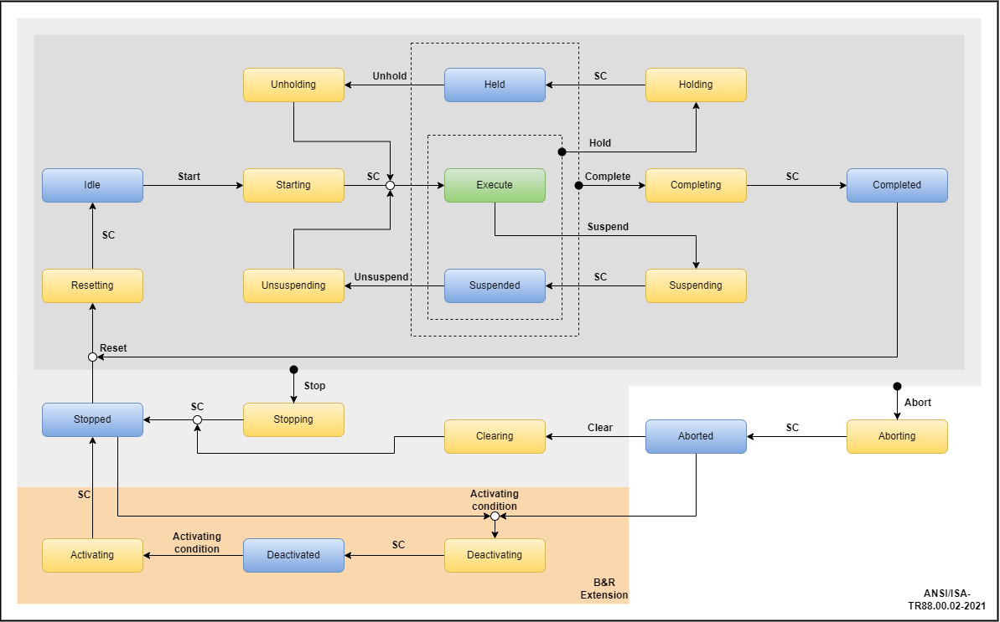
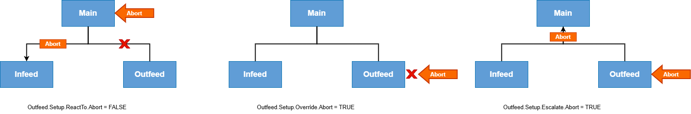
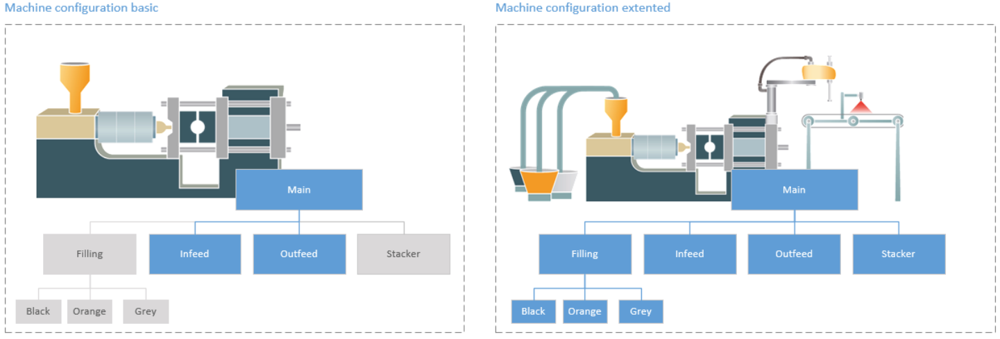
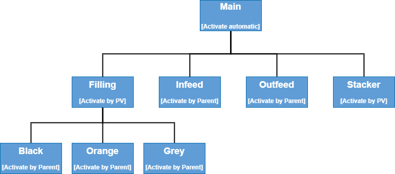
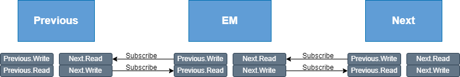
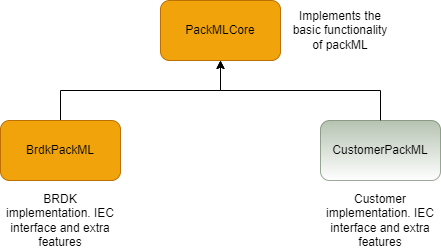

Full documentation is published at [https://brdk-public.github.io/BrdkPackML](https://brdk-public.github.io/BrdkPackML)

Repository and releases are located at [https://github.com/BRDK-Public/BrdkPackML](https://github.com/BRDK-Public/BrdkPackML)

## State model



## Synchronization

There are three different synchronization terms that sets the rules for how the hierarchy is synchronized.

The synchronization settings are only evaluated if the module have a parent module. If the module is Level 0 (Top most parent) the synchronization settings are not considered.

The settings are specified in the Setup.Synchronization structure `EMSynchronizationType` on the module.

The settings are initially set up so that, Abort, Stop, Complete, Suspend, Unsuspend and Held can be set in any module and escalated to the entire hierarchy.

The commands Clear, Reset, Start and Unhold are all overridden and can only be initiated by the parent. This default behaviour can be ommited in the setup of each module.


### Override

The Override specifies if the local commands from the child module should be overridden by the parent module.

If the Override settings are TRUE, local commands are not possible, but overridden by the parent. However - local commands can still be escalated.


Parameters and default values:


```
	- Override.Abort:		FALSE
	- Override.Stop: 		FALSE
	- Override.Complete: 	FALSE
	- Override.Suspend: 	FALSE
	- Override.Unsuspend: 	FALSE
	- Override.Hold: 		FALSE
	- Override.Unhold: 		TRUE
	- Override.Clear: 		TRUE
	- Override.Reset: 		TRUE
	- Override.Start: 		TRUE
```


### React To

The ReactTo specifies if the module should react to the parent state changes for the individual commands. It is still possible to give commands locally on the module with this setting. The ReactTo is only evaluated if it doesn't already have Override.

If a module don't ReactTo or Override, it will not be synchronized with the hierarchy above, and the parent will not wait for this module


Parameters and default values:


```
	- ReactTo.Abort:		TRUE
	- ReactTo.Stop:			TRUE
	- ReactTo.Complete: 	TRUE
	- ReactTo.Suspend: 		TRUE
	- ReactTo.Unsuspend: 	TRUE
	- ReactTo.Hold:			TRUE
	- ReactTo.Unhold: 		TRUE
	- ReactTo.Clear: 		TRUE
	- ReactTo.Reset: 		TRUE
	- ReactTo.Start: 		TRUE
```


### Escalate

The Escalate specifies if the local commands shall be escalated to the parent.


Parameters and default values:


```
	- Escalate.Abort:		TRUE
	- Escalate.Stop: 		TRUE
	- Escalate.Complete: 	TRUE
	- Escalate.Suspend: 	TRUE
	- Escalate.Unsuspend: 	TRUE
	- Escalate.Hold: 		TRUE
	- Escalate.Unhold: 		FALSE
	- Escalate.Clear: 		FALSE
	- Escalate.Reset: 		FALSE
	- Escalate.Start: 		FALSE
```


### Example


### SkipStopStateComplete

Abort is the only command where a Command.StateComplete is NOT required in order to transit to the next state. For some machines a similar behaviour is required for Command.Stop.  

The `SkipStopStateComplete` setting on `EMSetupType` makes Command.StateComplete irelevant in case of a stop command. This could be relevant for simple continuous running machines, where it doesn't matter when the machine is stopped.


## Activation

The Activation condition is defined in `EMSetupType`, using one of the options in `EMActivationConditionEnum`. The module only becomes active if the respective Activation condition applies.

If command "StateComplete" has already been started but the enabling condition does not yet apply, the module remains in state "Deactivated" until the enabling condition is fulfilled. 

Inactive modules can be enabled and added at any time. This allows additional modules to be included in the machine process depending on the current product. 

An Automation Studio project may contain all modules and, depending on the respective configuration of a machine unit, other modules can be enabled or disabled.


### Example

### Automatic

If "Automatic" is selected, the Activation condition is automatically valid. This option can be selected for a module that should always be available and used, such as module "Main", "Infeed" or "Outfeed". With this enabling condition, the module immediately switches to state "Activating".

### By PV

Using "By PV", the Activation condition is based on the state of the process variable. If the process variable is TRUE, the Activation condition becomes valid. If the specified process variable is FALSE, the Activation condition is no longer valid and the module can be disabled. This Activation condition is suitable for modules that are optional. It allows the module to be enabled or disabled as required depending on the machine configuration. 

### By Parent

By selecting "By parent", the Activation condition becomes valid as soon as the higher-level module is active. This option can be selected if the higher-level module is an optional module. This makes the configuration of linked modules easier during initial configuration and for understanding the correlations at a later point in time.

### Example

### Deactivating a module


An enabled module can also be disabled again. It is important to note that only modules whose enabling condition has been set to "By PV" or "By parent" in the Setup can be disabled. 

To disable the module, it must be in state "Aborted" or "Stopped". As soon as the Activation condition defined in the configuration is no longer valid, the module is disabled. This puts the module in state "Deactivating". Command "StateComplete" switches the module to state "Deactivated". This disables the module. 

The Activation condition is only checked in ("Aborted", "Stopped"). It is not checked in any other state.


## Mode changes

Changing the mode can be done by using the function `EMSetMode` or by setting the mode directely on the EquipmentModule instance. The mode change will only succeed if all modules are in the same state.

When changing the mode on a module, all children of this module will also change mode. Mode changes should therefor be done only on the Root/Main.

If some part of the machine should be controlled seperately in e.g Maintenance mode while the rest of the machine is kept in Producing, it should be decoupled from the parent first to break the syncronization.

A module will decouple from its parent, when the `ParentName` setting on `EMSetupType` is set to an empty string. A module can be connected to the parent again by setting `ParentName` to the name of the parent. The module will then set the mode equal to its parent and catch up to the same state as the rest of the machine


## Command priorities
### In general

The `Commands` structure is prioritized in case multiple commands are triggered in the same cycle.

In general the "Abort" command has the highest priority followed by the "Stop" and the "StateComplete" has the lowest priority.
The commads are evaluated in the following order:

- **Abort -> Stop -> NextStateCommand -> StateComplete**

### State Execute

- **Abort -> Stop -> Complete -> Hold -> Suspend -> StateComplete**


### State Held

- **Abort -> Stop -> Complete -> Unhold -> StateComplete**


### State Suspended

- **Abort -> Stop -> Complete -> Hold -> Unsuspend -> StateComplete**


## User Data

An EquipmentModule has a dedicated storage area in the heap memory area. This storage area is used to store (publish) a data structure `EMUserDataPubSubType` from the EquipmentModule and allows other modules to access (subscribe) the data.

The data structure should be modified to suit the needs of the machine or overall framework. The usecases for such pub/sub interface could be: Syncrozisation handshakes, prioritized order for start/stop or passing product info between modules.

A module will always publish the variables inside `EM.Interface.Publish`. To subscribe to the interface of another module, `EM.Interface.SubscriptionEmName` should be set to the name of the module. `EM.Interface.SubscriptionValid` becomes true if the module is found and data is copied.

Another way to get the data from another module is to use the function `EMGetUserDataAdr`. This function makes it possible to loop over a number of modules e.g all modules, all children, all siblings or all roots if it is used in combination with `EMGetModuleAdrByIdx`, `EMGetChildrenAdrByIdx`, `EMGetSiblingAdrByIdx` or `EMGetRootAdrByIdx`.


**Example of usage:**




## Step Mode

StepMode is an option for the EquipmentModule and the ControlModule. It can be used for testing and debugging the states and substates. When StepMode is TRUE, the change in State and Substate (ControlModule) and Substate (EquipmentModule) will only be allowed when the Continue is set TRUE.
StepMode is automatically disabled when the EquipmentModule changes state. That way an Aborting or Stopping sequence will not be halted be the StepMode feature if eneabled.

### NB: 
When the State/Substate is changed with StepMode enabled, the State/Substate will be set to the value -1 while it is waiting for the Continue command. -1 is therefor a reserved State/Substate value for EquipmentModule Substate and ControlModule State and Substate


## Dependencies

This library is dependent on the "PackMLCore" library. The core libraries can be used for creating other "flavours" of packML.


